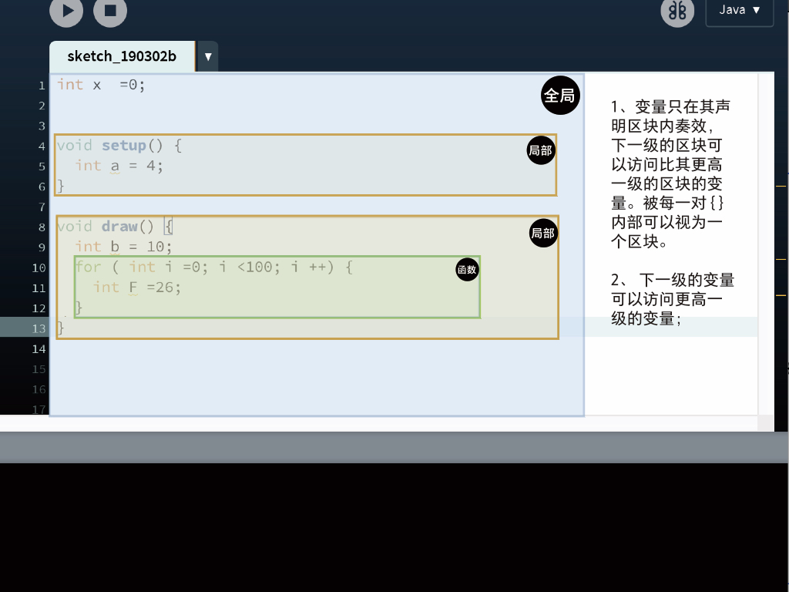

[toc]
## 01

### Processing IDE

### 优雅的编程：规范编程

1. 注释
2. 性能
3. 写代码的基本规则
    * 大小写敏感；
    * 每行以';'结束；
    * 代码要用英文输入法；
    * '//'之后的是注释，可以用中文；
    * 驼峰命名法 'myCircle'
        * 每{...}之内是一个单元
    * 在坐标系中绘图
    * 用数字控制属性
        * 255: 8个字节：2^8=256 个等级
        * 颜色: RGB, HSB
        * 大小:width,height,(x,y,z)
        * 位置:(x,y,z)

### 知识点小结

1. Processing 的IDE是一个编译环境，允许你通过processing的语言向计算机输入指令并执行程序。
2. processing的语言：
    1. 计算机是逐行阅读你写的代码，
    2. Processing的每一行代码由 ‘ `;` ’号结束；
    3. **空格** 和 **回车** 默认忽视；
    4. 代码是大小写敏感的，
        * **不要使用中文输入法写代码！**
        * **不要用拼音命名！**
    5. ‘ `//` ’之后的代码默认为笔记或注释，不予阅读。 ‘ `//` ’ 也可以用来注释代码，注释后的代码会变成灰色
    6. 语句基本是由  `名称 （  参数 ，参数  ) ;` 的形式书写的
        1. 例如：`size ( 600 , 400 ) ; `  
3. 绘图：
    1. 记住，你是在 坐标系 中，以 像素 的方式绘图！
    2. 每个基本图形都是由 函数名 + 参数 组成的
        1. `rect ( x1, y1, x2, y2 ) ;`
        2. `ellipse ( x, y , w , h ) ;`
    3. 你也可以自定义一个形状
        1. `beginShape ( );`  + `vertex + endShape();`
    4. 用数字控制属性
        * 255: 8个字节：2^8=256 个等级
        * 颜色: `RGB`, `HSB`
        * 大小: `width`, `height`, `(x,y,z)`
        * 位置:`(x,y,z)`

---

## 02
### 变量的作用域
>知识点：
> 补充：
> - translate(); pushMatrix(); popMatrix();
> - rotate();
> - beginShape() & endShape vertex();

> 1.变量的作用域
> 2.for 循环
> 3.if 条件语序
> 4. I/O: 图片、键盘、鼠标
> 5.随机： Noise()
> 6. 网格

```Processing
int x, y, w, h;

void setup() {
  size(600, 600);
  background(255);
  x = 0;
  y =0;
  w = 200;
  h = 200;
}

void draw() {
  background(255);
  //translate(width/2,height/2);   //转换坐标系
  //rotate(radians(45));   //  
  //rectMode(CENTER);
  //rect(x,y,w,h);

  //translate(mouseX,mouseY);

  pushMatrix();
  translate(width/2, height/2);
  colorMode(RGB, 255);

  rotate(radians(45));
  rectMode(CENTER);
  rect(0, 0, 200, 200);
  stroke(255, 0, 0);
  line(-600, 0, 600, 0);
  line(0, -600, 0, height);

  popMatrix();
  fill(0,200,100);
  rect(0,0,200,200);
}

```

```Processing
int x  =0;

void setup() {
    int a = 4;
}

void draw() {
    int b = 10;
    for ( int i =0; i <100; i ++) {
        int F =26;
    }
}

```


**数据的类型**
- int，float , boolean, byte, char, String, duble, color…
### for 循环

```JAVA
for( int i = 0; i <100; i ++) {

}

//循环可以嵌套
for(int i =0; i <100; i ++) {
    for(int j=0; j <200; j ++) {
        for(...) {
            ...
    }
}
```
### if

```JAVA
if（ a >0 ){
    rect(0,0,20,20);
}else if(a <20) {
    ellipse(20,20,30,30);
}else {
    fill(0);
    peintln("Game Over!");
}
```

#### keyPressed  key switch() {}

```Processing
//条件语序

int x;
float a;
boolean f = true;

char keyWord = 'e';
String man = "xiaoming";

void setup() {
}


void draw() {

  switch (keyWord) {
  case '1':
    background(255);
    break;
  case '2':
    background(255, 0, 0);
    break;
  case '3':
    background(0, 255, 0);
    break;
  }
}

void keyPressed() {
  keyWord  = key;  //当我的键盘按1：则 keyWord = '1';
}

```
#### 方块矩阵

```Processing
//translate(0,0);
//pushMatrix();
//popMatrix();
//rotate(radians(角度))；
//+ for();
/*
  - for( i )
*/


int x = 0;
int w = 20;
float angle=0;

void setup() {
  size(600, 600,P2D);
  pixelDensity(2);
}

void draw() {
  background(255);

  //colorMode(HSB, width, 100, 100);

  //for ( int i=00; i < w*2*6; i+=w*2 ) {
  //  pushMatrix();
  //  translate(i,height/2);
  //  rotate(radians(60));
  //  fill(i, 100, 100);
  //  //line(i, 0, i, height);
  //  rect(0,0,w,w);
  //  popMatrix();
  //}

  for(int i = w+15; i < width-w; i += w*2) {
    for(int j = w+5; j < width-w; j += w*2){
      rectMode(CENTER);
      fill(sin(angle)*255,255-sin(angle)*255,100);
      pushMatrix();
      translate(i,j);
      //rotate(radians(60));
      rotate(angle);
      rect(0,0,w,w);
      popMatrix();
    }
  }

  angle += 0.01;
}

```
