# 目录
[toc]


# Processing 入门
## 01

### Processing IDE

### 优雅的编程：规范编程

1. 注释
2. 性能
3. 写代码的基本规则
    * 大小写敏感；
    * 每行以';'结束；
    * 代码要用英文输入法；
    * '//'之后的是注释，可以用中文；
    * 驼峰命名法 'myCircle'
        * 每{...}之内是一个单元
    * 在坐标系中绘图
    * 用数字控制属性
        * 255: 8个字节：2^8=256 个等级
        * 颜色: RGB, HSB
        * 大小:width,height,(x,y,z)
        * 位置:(x,y,z)

### 知识点小结

1. Processing 的IDE是一个编译环境，允许你通过processing的语言向计算机输入指令并执行程序。
2. processing的语言：
    1. 计算机是逐行阅读你写的代码，
    2. Processing的每一行代码由 ‘ `;` ’号结束；
    3. **空格** 和 **回车** 默认忽视；
    4. 代码是大小写敏感的，
        * **不要使用中文输入法写代码！**
        * **不要用拼音命名！**
    5. ‘ `//` ’之后的代码默认为笔记或注释，不予阅读。 ‘ `//` ’ 也可以用来注释代码，注释后的代码会变成灰色
    6. 语句基本是由  `名称 （  参数 ，参数  ) ;` 的形式书写的
        1. 例如：`size ( 600 , 400 ) ; `  
3. 绘图：
    1. 记住，你是在 坐标系 中，以 像素 的方式绘图！
    2. 每个基本图形都是由 函数名 + 参数 组成的
        1. `rect ( x1, y1, x2, y2 ) ;`
        2. `ellipse ( x, y , w , h ) ;`
    3. 你也可以自定义一个形状
        1. `beginShape ( );`  + `vertex + endShape();`
    4. 用数字控制属性
        * 255: 8个字节：2^8=256 个等级
        * 颜色: `RGB`, `HSB`
        * 大小: `width`, `height`, `(x,y,z)`
        * 位置:`(x,y,z)`

---

## 02
### 变量的作用域
>知识点：
> 补充：
> - translate(); pushMatrix(); popMatrix();
> - rotate();
> - beginShape() & endShape vertex();

> 1.变量的作用域
> 2.for 循环
> 3.if 条件语序
> 4. I/O: 图片、键盘、鼠标
> 5.随机： Noise()
> 6. 网格

```Processing
int x, y, w, h;

void setup() {
  size(600, 600);
  background(255);
  x = 0;
  y =0;
  w = 200;
  h = 200;
}

void draw() {
  background(255);
  //translate(width/2,height/2);   //转换坐标系
  //rotate(radians(45));   //  
  //rectMode(CENTER);
  //rect(x,y,w,h);

  //translate(mouseX,mouseY);

  pushMatrix();
  translate(width/2, height/2);
  colorMode(RGB, 255);

  rotate(radians(45));
  rectMode(CENTER);
  rect(0, 0, 200, 200);
  stroke(255, 0, 0);
  line(-600, 0, 600, 0);
  line(0, -600, 0, height);

  popMatrix();
  fill(0,200,100);
  rect(0,0,200,200);
}

```

```Processing
int x  =0;

void setup() {
    int a = 4;
}

void draw() {
    int b = 10;
    for ( int i =0; i <100; i ++) {
        int F =26;
    }
}

```
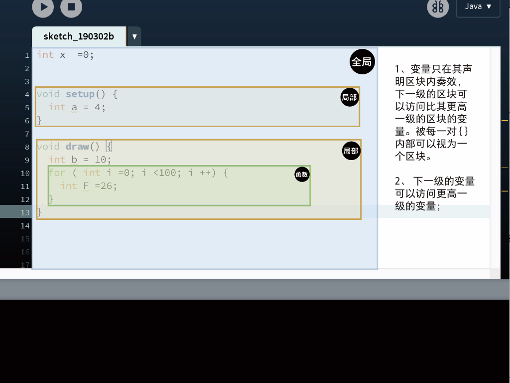

**数据的类型**

- int，float , boolean, byte, char, String, duble, color…

### for 循环

```Processing
for( int i = 0; i <100; i ++) {

}

//循环可以嵌套
for(int i =0; i <100; i ++) {
    for(int j=0; j <200; j ++) {
        for(...) {
    }
}
```

### if

```Processing
if（ a >0 ){
    rect(0,0,20,20);
}else if(a <20) {
    ellipse(20,20,30,30);
}else {
    fill(0);
    peintln("Game Over!");
}
```
---

## 03
补充：[运算级](https://blog.csdn.net/xiaoli_feng/article/details/4567184)，boolean(),  String();, text();


- [x] 函数/function
- [x] I/O :image mouse
    - [x] 图片调色板

制作GIF

## 函数
```Processing
float h;
float a;
float b;
void set() {
  a = 4;
  b = 10;
}

void draw() {

  boolean ho =judment(3, 5);
  int h = sum(10, 25);
  println("判断  "+ho);
  println("求和  "+h);
  drawBlurCircle(mouseX,mouseY,(int)random(255));
}


boolean judment(int a, int b) {
  boolean g = false;
  if (a > b) {
    g = true;
  }
  return g;
}


int sum(int a, int b) {
  int c = a + b;

  return c;
}

void drawBlurCircle(int x, int y, int c) {
  fill(255, 20);
  rect(0, 0, width, height);
  fill(c);
  ellipse(x, y, 30, 30);
}

```
### I/O :

##### 图片PImage

```Processing
PImage img;

void setup(){
    size(1080,720);
    img = loadImage("exampleImage.jpg");

    //img.filter（GRAY）；
}

void draw() {
    image(img, x,y, img.width, img.height);

    tini(color(200,100,200))；   //颜色值

}

```

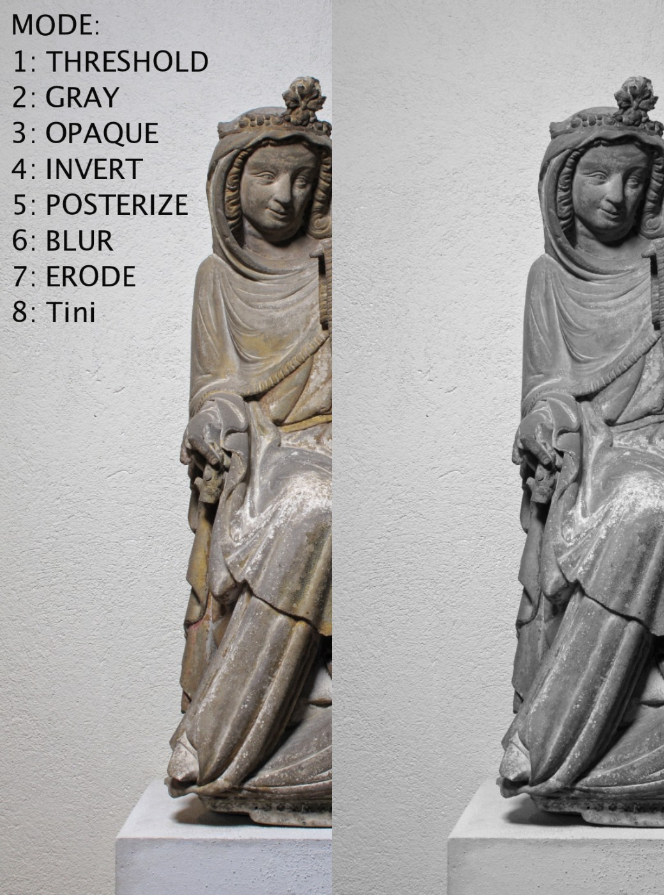
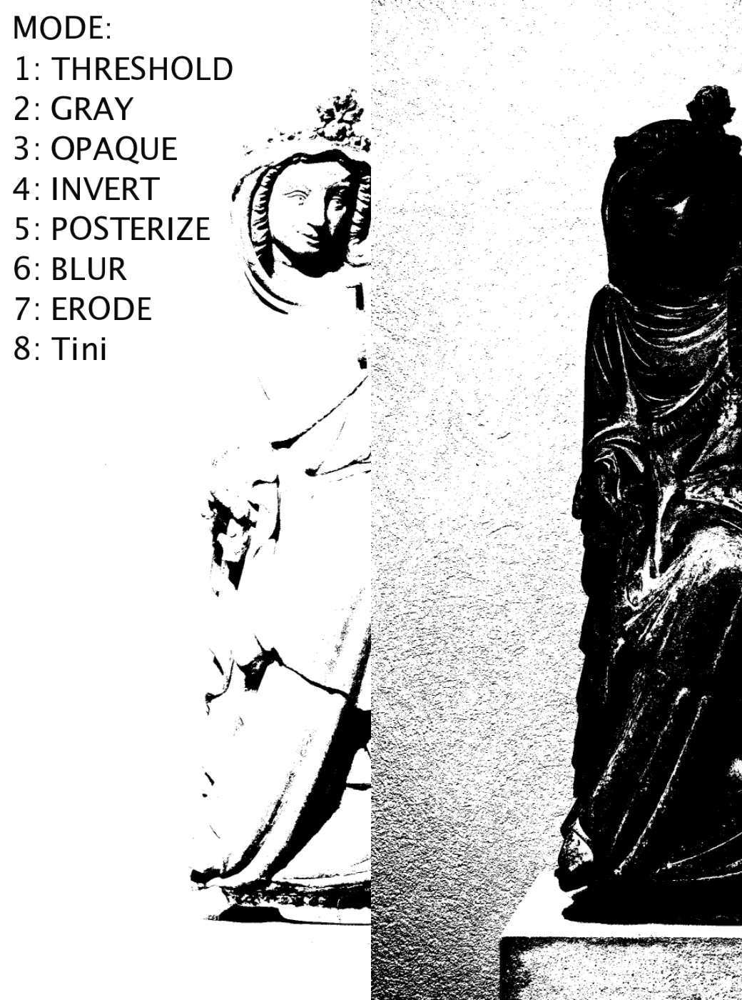
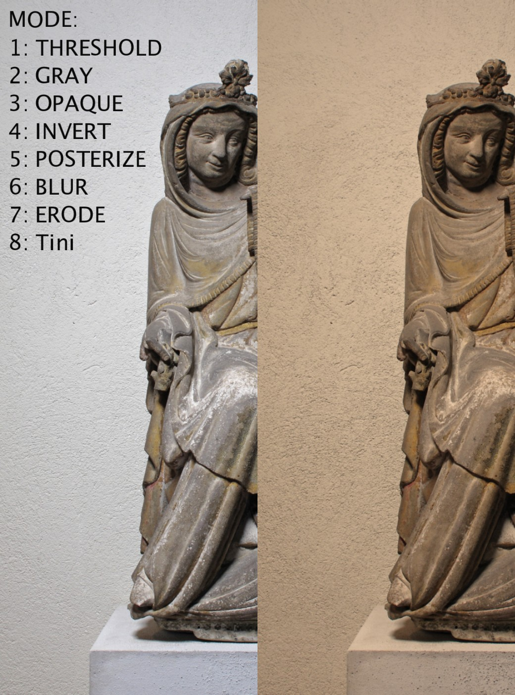

##### image-Pixels

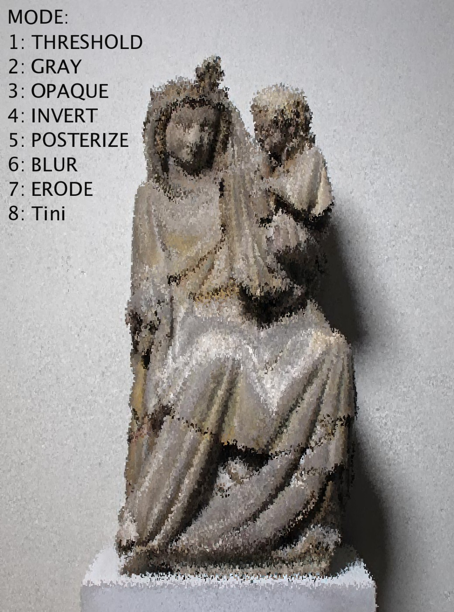

##### 键盘keypressed、

```Processing

void setup(){

}

void draw() {

}

void keyPressed() {
 if(key == 's') {
     fill(255,0,0);
     rect(mouseX, mouseY, 50,50);
 }
}
//鼠标mousePressed
void mousePressed() {

}
```

---
# 04
- [ ] Video
- [ ] Noise
- [ ] GIF
- [ ] 对象

```Proicessing
//PImage


```
### 随机：

#####random(), perlin 噪音

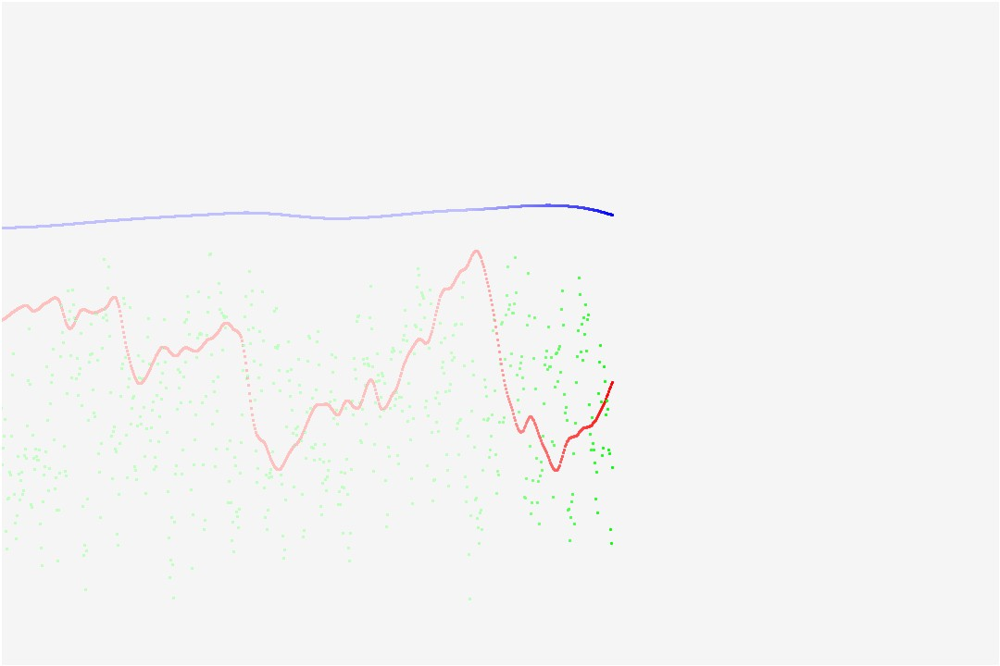

```Processing
float t1, t2, t3 = 1;
float perlin, perlin2, perlin3 =0.0;
int x = 0;

void setup() {
  size(1080, 720);
  background(245);
}

void draw() {
  fill(255,2);
  stroke(255);
  rect(0,0,width,height);

  perlin = noise(t1);
  perlin2 = noise(t2);
  perlin3 = noise(t3);

  float p = map(perlin, 0, 1, 0, height-200);
  float p2 = map(perlin2, 0, 1, 0, height-200);
  float p3 = map(perlin3, 0, 1, 0, height-200);

  strokeWeight(3);
  stroke(0, 0, 255);
  point(x, p);
  stroke(255, 0, 0);
  point(x, p2+100);
  stroke(0, 255, 0);
  point(x, p3+200);

  x += 1;
  if (x >= width) {
    x =0;
  }
  t1 += 0.001;
  t2 += 0.01;
  t3 += 0.3;
}

void keyPressed() {

  if (key == 's') {
    saveFrame("screenShot-###.jpg");
    print("image saved!");
  }
}

```
#### 绘制海

- [ ] Video
- [ ] Noise
    - [ ] 2d
    - [ ] 3d
- [ ] 对象

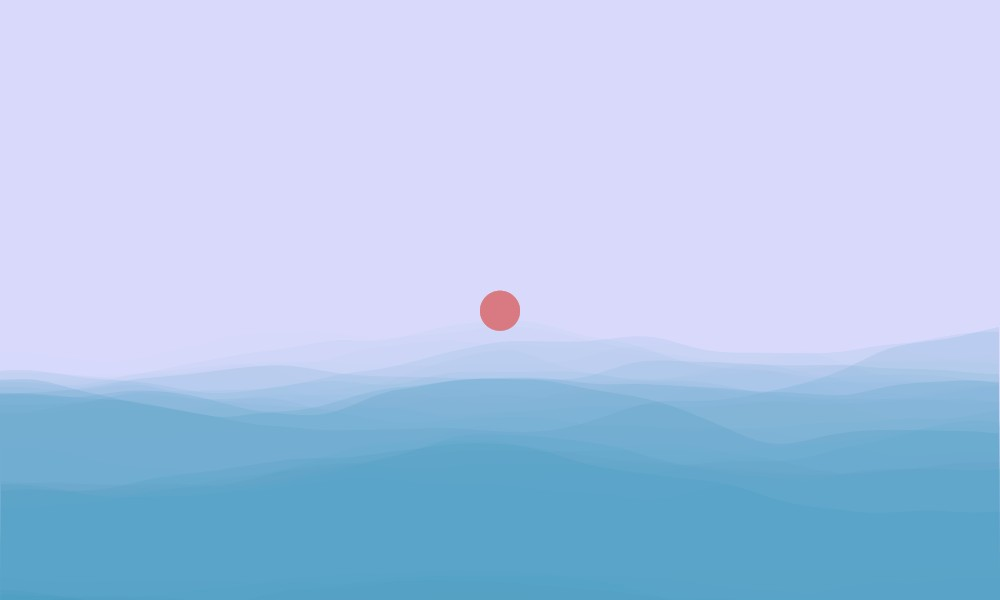

```Processing
float xoff=0;    //浮点数 float
float yoff = 0;

void setup(){

size(1000,600);
//frame.ReSizable(true);
}

void draw() {

  frameRate(2);
  noStroke();
  fill(216,81,78,80);
ellipse(width/2,height*.518,40,40);     //太阳

//渐变
  fill(217,217,277,30);
  rect(0,0,width,height);


beginShape();      
fill(38,138,178,35);
noStroke();

for(int i=0; i <width; i ++){

  vertex(i,noise(xoff,yoff)*180+300);
  xoff +=0.002;
}
vertex(width,height);
vertex(0,height);
endShape(CLOSE);

//2
beginShape();
fill(38,138,178,27);
noStroke();
for(int i=width; i >0; i --){

  vertex(i,noise(xoff,yoff)*150+400);
  xoff +=0.002;
}
vertex(0,height);
vertex(width,height);
endShape(CLOSE);


//3
beginShape();
fill(38,138,178,25);
noStroke();
for(int i=width; i >0; i --){

  vertex(i,noise(xoff,yoff)*100+550);
  xoff +=0.002;
}
vertex(0,height);
vertex(width,height);
endShape(CLOSE);


yoff+=0.01;

}

void keyPressed() {

  if (key == 's') {
    saveFrame("screenShot-###.jpg");
    print("image saved!");
  }
}
```

### 在网格中绘图

#### 伪代码

- 让光谱的网格随着鼠标的移动改变色相与饱和度
    1. 声明需要的变量：网格的间隔
    2. 在setup()中 设定画布的大小
    3. 将颜色模式设置成 HSB（色相、饱和度、亮度）的模式
    4. 用rect() 和 for() 来绘制网格
    5. 用rect() 的x y 坐标来改变颜色的值产生光谱的效果
    6. 用鼠标的x 坐标来控制网格间隔宽度


```Processing
int stepX, stepY;            //间隔

```
```Processing
 size(600, 600, P2D);
```
```Processing
colorMode(HSB, 100);
```

```Processing
stepX = 60;
stepY = 60;
```

```Processing
for ( int i =0; i < height; i += stepY) {
  for (int j = 0; j < width; j += stepX) {
    rect(i, j, stepX, stepY);
  }
}
```
完整代码：

```Processing
int stepX, stepY;   //网页的 横向与纵向的间隔

void setup() {
  size(600, 600, P2D);
}


void draw() {
  colorMode(HSB, 100);
  background(255);
  stepX = 60;
  stepY = 60;

  for ( int i =0; i < height; i += stepX) {
    for (int j = 0; j < width; j += stepY) {
      rect(i, j, stepX, stepY);
    }
  }
}

```

效果：
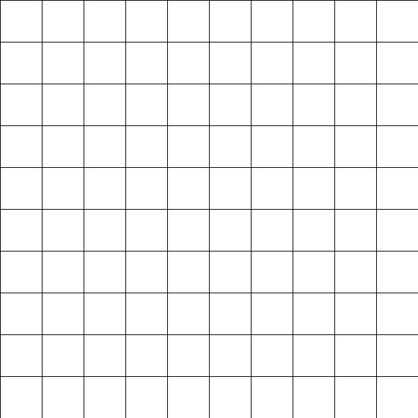


用更简洁的方式给颜色赋值：

```Processing
color c;

c = color(H, S, B);
fill(c);

colorMode(HSB, width, height, 100);
```

```Processing
c = color(i,height-j,100);
fill(c);  
```
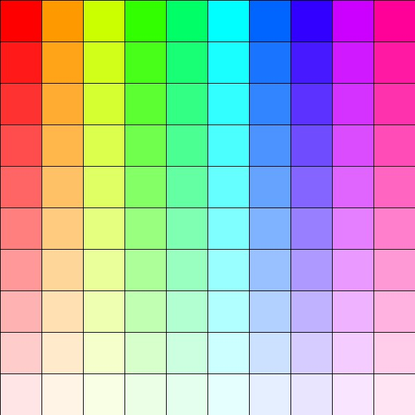

**将鼠标坐标值赋予给网格宽度**

```Processing
stepX = mouseX+5;
stepY = mouseY+5;
```
### video & camera

获取摄像头


```Processing
import processing.video.*;

Capture video;

//细胞单元的大小
int cellSize = 20;
//列和行的 数量
int cols, rows;

void setup() {
  size(640, 360);
  frameRate(30);

  String[] cameras = Capture.list();

  if(cameras ==null) {
    print("获取摄像头列表失败...");
    video = new Capture(this, 640, 360);
  }if (cameras.length ==0) {
    print("您的电脑没有可用的摄像头！或者摄像头已损坏");
    exit();
  }else {
    print("可用的谁想头为：");
    printArray(cameras);
  }
  video = new Capture(this, cameras[0]);

  video.start();
  background(0);

}

void draw() {

  if(video.available()) {
    video.read();
    //video.loadPixels();

    image(video,0,0,width,height);
    //for(int i  = 0; i < cols; i ++) {
    //  for(int j = 0; j <rows; j ++) {
    //    int x = i*cellSize;
    //    int y = j*cellSize;

    //    int loc = (video.width - x -1) +
    //  }

    //}

  }

}
```

#### 作业一：Title line

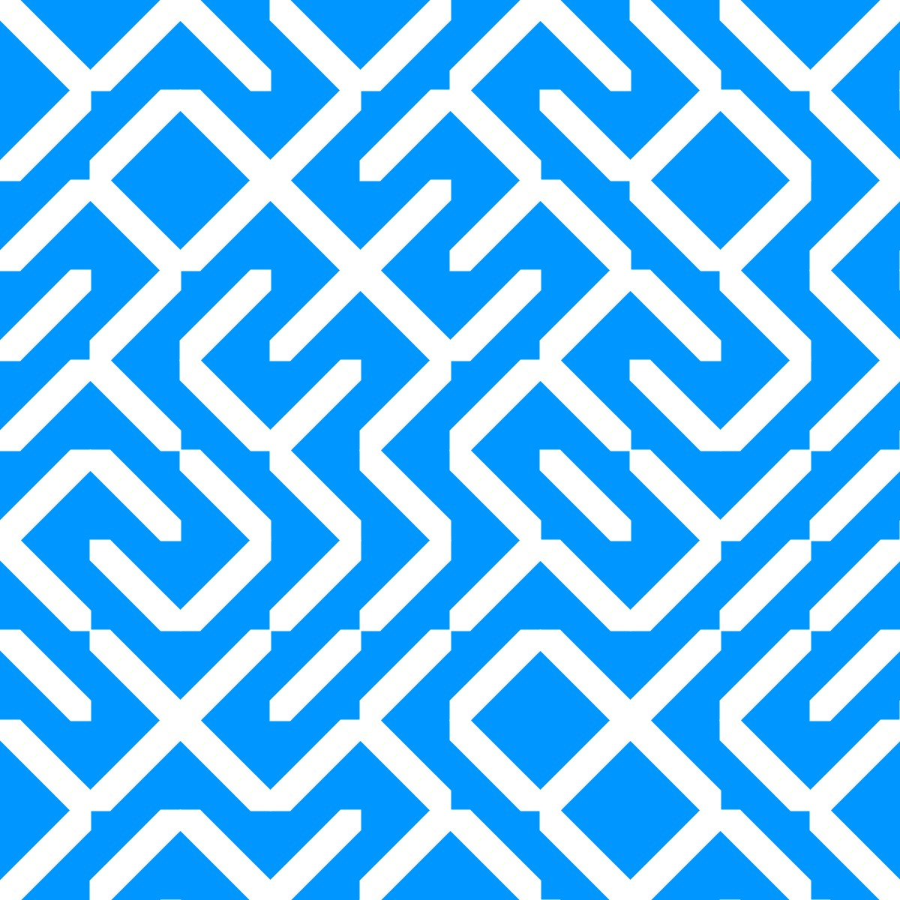

**One line Draw**
-

### openCV
### font & text
### 动态海报

## ps: 效果存档

**推荐： saveFrame() + GIMP  方便快捷**


1. Fime maker :
    - 优点：不掉帧，速度可控，不损失质量
    - 缺点：步骤略繁琐，占用空间比较大
2. gifAnimation:
    1. 优点：质量不错，方便；
    2. 掉帧严重，速度不可控；
3. 三方软件:LICEcap
    1.  不影响运行速度，帧率可控，一般繁琐
    2. 质量一般
3. saveFrame + adobe ps
4. 🔗 ffmpeg: https://ffmpeg.org/  终端操作


---

# Perlin Noise

**document:**

🔗 [Perlin Noise-wiki:]( https://zh.wikipedia.org/wiki/Perlin%E5%99%AA%E5%A3%B0)
🔗 http://web.archive.org/web/2016053012...
🔗 Gradient Noise: https://en.wikipedia.org/wiki/Gradien...
🔗 Simplex Noise: https://en.wikipedia.org/wiki/Simplex...
🔗 Stefan Gustavson: http://staffwww.itn.liu.se/~stegu/
🔗 Simplex noise demystified: http://staffwww.itn.liu.se/~stegu/sim...
🔗 OpenSimplexNoise.java by KdotJPG: https://gist.github.com/KdotJPG/b1270...
🔗 Etienne Jacob: https://necessary-disorder.tumblr.com/  --(GIF制作教程)

🚂 Website: http://thecodingtrain.com/
💖 Patreon: https://patreon.com/codingtrain
🛒 Store: https://www.designbyhumans.com/shop/c...
📚 Books: https://www.amazon.com/shop/thecoding...

🎥 Coding Challenges: https://www.youtube.com/playlist?list...
🎥 Intro to Programming: https://www.youtube.com/playlist?list...

🔗 p5.js: https://p5js.org
🔗 Processing: https://processing.org

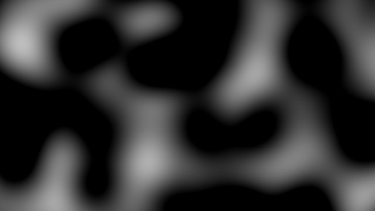


---
# Noise Loop + motion blur

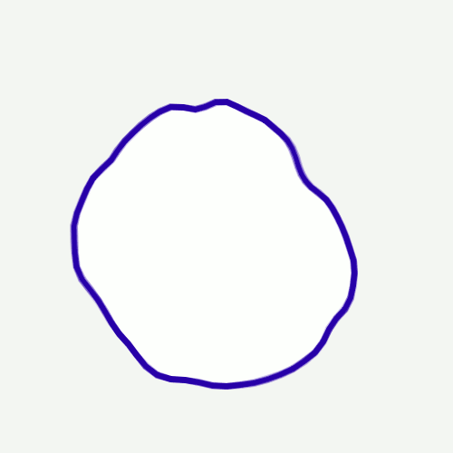

---
# ffmpeg GIF maker 教程  

第一步

下载 brew home
https://brew.sh/

terminal 终端输入

```Shell
/usr/bin/ruby -e "$(curl -fsSL https://raw.githubusercontent.com/Homebrew/install/master/install)"
```
第二步
下载 ffmpeg:
终端输入

```Shell
install ffmpeg
```

第三步

```Shell
cd /你的文件夹路径
```

第四步

```Shell
ffmpeg -f image2 framerate 30 -i ouput/gif-%3d.png gifName.gif
```
`image2` ：是循环模式；
`framerete 30` ： 帧率 30；
`ouput/gif-%3d.png` : 在`ouput`文件夹下，名为：`gif-001.png`到`gif-XXX.png`的图片， `3d`表示有几位序列数字

**参考链接：** https://ffmpeg.org/ffmpeg-all.html#image2-1
